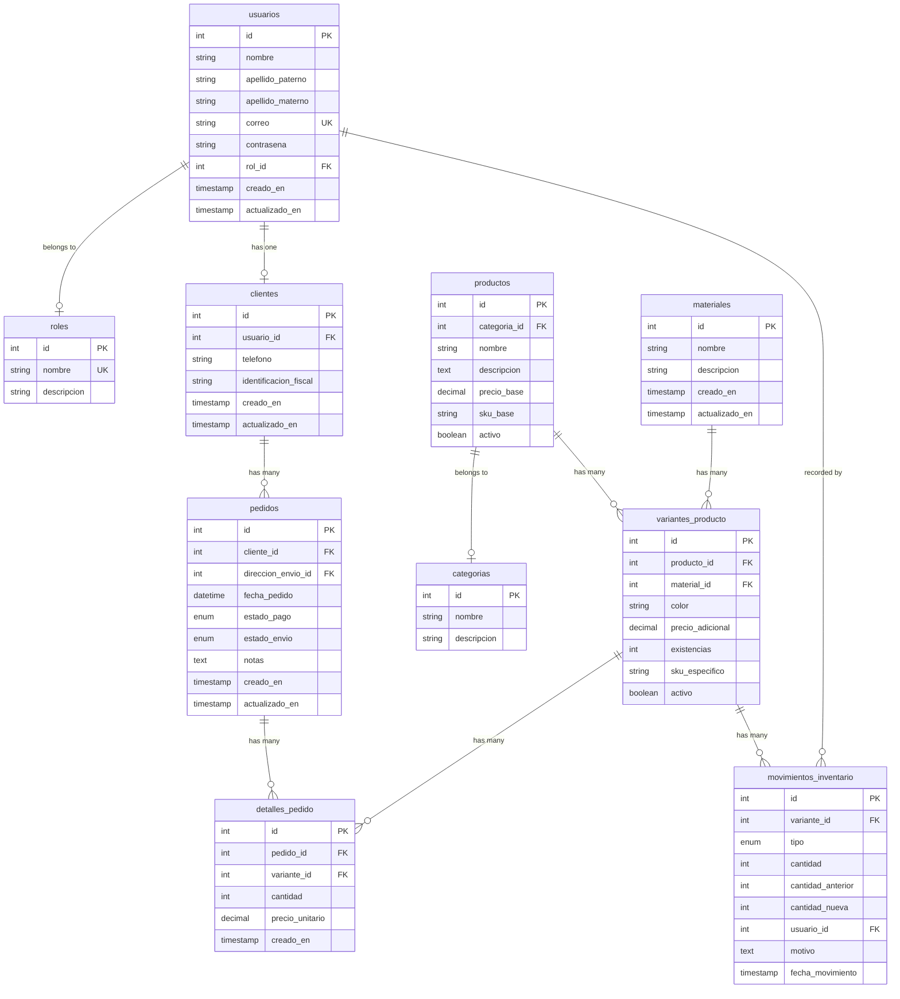

## Overview

SOLARE uses a MySQL database named `muebleria_db` with custom Spanish column names. The schema supports a complete e-commerce workflow including user management, product catalog, inventory tracking, and order processing.

<Note>
All table and column names are in Spanish to align with the business domain language. Models use custom configurations to map to these names.
</Note>

## Database Tables Summary

| Table | Model | Purpose |
|-------|-------|----------|
| `usuarios` | `User` | System users (employees and customers) |
| `roles` | `Rol` | User roles for RBAC |
| `clientes` | `Cliente` | Customer-specific profile data |
| `categorias` | `Categoria` | Product categories |
| `productos` | `Producto` | Base product information |
| `materiales` | `Material` | Available materials for variants |
| `variantes_producto` | `VarianteProducto` | Product variants (material/color combinations) |
| `pedidos` | `Pedido` | Customer orders |
| `detalles_pedido` | `DetallePedido` | Order line items |
| `movimientos_inventario` | `MovimientoInventario` | Inventory audit trail |

## Entity Relationship Diagram



## Table Details

### usuarios (Users)

**Model:** `App\Models\User`

Stores all system users including employees and customers.

```php app/Models/User.php
class User extends Authenticatable
{
    use HasFactory, Notifiable, HasApiTokens;
    
    protected $table = 'usuarios';
    
    protected $fillable = [
        'nombre',
        'apellido_paterno',
        'apellido_materno',
        'correo',
        'contrasena',
        'rol_id',
    ];
    
    protected $hidden = ['contrasena', 'token_recuerdo'];
    
    // Custom password field
    public function getAuthPassword() {
        return $this->contrasena;
    }
    
    // Relationships
    public function rol() {
        return $this->belongsTo(Rol::class, 'rol_id');
    }
    
    public function cliente() {
        return $this->hasOne(Cliente::class, 'usuario_id');
    }
}
```

**Columns:**

| Column | Type | Description |
|--------|------|-------------|
| `id` | INT (PK) | Primary key |
| `nombre` | VARCHAR(100) | First name |
| `apellido_paterno` | VARCHAR(100) | Paternal surname |
| `apellido_materno` | VARCHAR(100) | Maternal surname (optional) |
| `correo` | VARCHAR(255) UNIQUE | Email address |
| `contrasena` | VARCHAR(255) | Hashed password |
| `rol_id` | INT (FK) | Foreign key to `roles` |
| `creado_en` | TIMESTAMP | Creation timestamp |
| `actualizado_en` | TIMESTAMP | Last update timestamp |

### roles (Roles)

**Model:** `App\Models\Rol`

Defines the 6 system roles for RBAC.

```php app/Models/Rol.php
class Rol extends Model
{
    protected $table = 'roles';
    
    protected $fillable = ['nombre', 'descripcion'];
    
    public function usuarios() {
        return $this->hasMany(User::class, 'rol_id');
    }
}
```

**Default Roles:**

1. `Administrador` - Full system access
2. `Gerente` - Management and reporting
3. `Supervisor` - Oversight and reports
4. `Vendedor` - Sales operations
5. `Almacenista` - Inventory management
6. `Cliente` - Customer access

### clientes (Customers)

**Model:** `App\Models\Cliente`

Extended profile information for customer users.

```php app/Models/Cliente.php
class Cliente extends Model
{
    protected $table = 'clientes';
    const CREATED_AT = 'creado_en';
    const UPDATED_AT = 'actualizado_en';
    
    protected $fillable = [
        'usuario_id',
        'telefono',
        'identificacion_fiscal'
    ];
    
    public function usuario() {
        return $this->belongsTo(User::class, 'usuario_id');
    }
    
    public function pedidos() {
        return $this->hasMany(Pedido::class, 'cliente_id');
    }
}
```

**Columns:**

| Column | Type | Description |
|--------|------|-------------|
| `id` | INT (PK) | Primary key |
| `usuario_id` | INT (FK) UNIQUE | One-to-one with `usuarios` |
| `telefono` | VARCHAR(20) | Contact phone |
| `identificacion_fiscal` | VARCHAR(50) | Tax ID (optional) |

### categorias (Categories)

**Model:** `App\Models\Categoria`

Product categorization (e.g., Sofás, Mesas, Sillas).

```php app/Models/Categoria.php
class Categoria extends Model
{
    protected $table = 'categorias';
    
    protected $fillable = ['nombre', 'descripcion'];
    
    public function productos() {
        return $this->hasMany(Producto::class, 'categoria_id');
    }
}
```

### productos (Products)

**Model:** `App\Models\Producto`

Base product catalog without specific variants.

```php app/Models/Producto.php
class Producto extends Model
{
    protected $table = 'productos';
    
    protected $fillable = [
        'categoria_id',
        'nombre',
        'descripcion',
        'precio_base',
        'sku_base',
        'activo'
    ];
    
    public function categoria() {
        return $this->belongsTo(Categoria::class, 'categoria_id');
    }
    
    public function variantes() {
        return $this->hasMany(VarianteProducto::class, 'producto_id');
    }
    
    public function imagenes() {
        return $this->hasMany(ImagenProducto::class, 'producto_id');
    }
}
```

**Key Fields:**

- `precio_base`: Base price before variant adjustments
- `sku_base`: Base SKU code
- `activo`: Boolean flag for active products

### materiales (Materials)

**Model:** `App\Models\Material`

Available materials for furniture (e.g., Cuero, Madera, Tela).

```php app/Models/Material.php
class Material extends Model
{
    protected $table = 'materiales';
    const CREATED_AT = 'creado_en';
    const UPDATED_AT = 'actualizado_en';
    
    protected $fillable = ['nombre', 'descripcion'];
    
    public function variantes() {
        return $this->hasMany(VarianteProducto::class, 'material_id');
    }
}
```

### variantes_producto (Product Variants)

**Model:** `App\Models\VarianteProducto`

Specific combinations of product + material + color with individual inventory tracking.

```php app/Models/VarianteProducto.php
class VarianteProducto extends Model
{
    protected $table = 'variantes_producto';
    
    protected $fillable = [
        'producto_id',
        'material_id',
        'color',
        'precio_adicional',
        'existencias',
        'sku_especifico',
        'activo'
    ];
    
    public function producto() {
        return $this->belongsTo(Producto::class, 'producto_id');
    }
    
    public function material() {
        return $this->belongsTo(Material::class, 'material_id');
    }
}
```

<Info>
**Pricing Logic:** Final price = `producto.precio_base` + `variante.precio_adicional`
</Info>

**Columns:**

| Column | Type | Description |
|--------|------|-------------|
| `existencias` | INT | Current stock quantity |
| `precio_adicional` | DECIMAL(10,2) | Price modifier for this variant |
| `sku_especifico` | VARCHAR(50) | Unique SKU for variant |
| `color` | VARCHAR(50) | Color name |

### pedidos (Orders)

**Model:** `App\Models\Pedido`

Order header information.

```php app/Models/Pedido.php
class Pedido extends Model
{
    protected $table = 'pedidos';
    const CREATED_AT = 'creado_en';
    const UPDATED_AT = 'actualizado_en';
    
    protected $fillable = [
        'cliente_id',
        'direccion_envio_id',
        'fecha_pedido',
        'estado_pago',
        'estado_envio',
        'notas'
    ];
    
    public function cliente() {
        return $this->belongsTo(Cliente::class, 'cliente_id');
    }
    
    public function detalles() {
        return $this->hasMany(DetallePedido::class, 'pedido_id');
    }
}
```

**Estado Fields:**

- `estado_pago`: `pendiente`, `pagado`, `cancelado`
- `estado_envio`: `procesando`, `enviado`, `entregado`

### detalles_pedido (Order Line Items)

**Model:** `App\Models\DetallePedido`

Individual items within an order.

```php app/Models/DetallePedido.php
class DetallePedido extends Model
{
    protected $table = 'detalles_pedido';
    const CREATED_AT = 'creado_en';
    const UPDATED_AT = null;  // No updates allowed
    
    protected $fillable = [
        'pedido_id',
        'variante_id',
        'cantidad',
        'precio_unitario'
    ];
    
    public function pedido() {
        return $this->belongsTo(Pedido::class, 'pedido_id');
    }
    
    public function variante() {
        return $this->belongsTo(VarianteProducto::class, 'variante_id');
    }
}
```

<Warning>
When a `DetallePedido` is created, a **MySQL trigger** automatically decrements the `variantes_producto.existencias` field. This ensures atomic inventory updates.
</Warning>

### movimientos_inventario (Inventory Movements)

**Model:** `App\Models\MovimientoInventario`

Audit trail for all inventory changes.

```php app/Models/MovimientoInventario.php
class MovimientoInventario extends Model
{
    protected $table = 'movimientos_inventario';
    const CREATED_AT = 'fecha_movimiento';
    const UPDATED_AT = null;
    
    protected $fillable = [
        'variante_id',
        'tipo',
        'cantidad',
        'cantidad_anterior',
        'cantidad_nueva',
        'usuario_id',
        'motivo'
    ];
    
    public function variante() {
        return $this->belongsTo(VarianteProducto::class, 'variante_id');
    }
    
    public function usuario() {
        return $this->belongsTo(User::class, 'usuario_id');
    }
}
```

**Movement Types:**

- `entrada`: Stock received
- `salida`: Stock removed
- `ajuste`: Manual adjustment

## Eloquent Relationships Summary

<Tabs>
  <Tab title="One-to-Many">
    ```php
    // Rol -> Users
    Rol::with('usuarios')->find(1);
    
    // Categoria -> Productos
    Categoria::with('productos')->get();
    
    // Producto -> VarianteProducto
    Producto::with('variantes')->find(5);
    
    // Material -> VarianteProducto
    Material::with('variantes')->get();
    
    // Cliente -> Pedidos
    Cliente::with('pedidos')->find(1);
    
    // Pedido -> DetallePedido
    Pedido::with('detalles')->find(10);
    ```
  </Tab>
  
  <Tab title="One-to-One">
    ```php
    // User -> Cliente (hasOne)
    $user = User::with('cliente')->find(3);
    $cliente = $user->cliente;
    
    // Cliente -> User (belongsTo)
    $cliente = Cliente::with('usuario')->find(1);
    $user = $cliente->usuario;
    ```
  </Tab>
  
  <Tab title="Belongs To">
    ```php
    // User -> Rol
    $user = User::with('rol')->find(1);
    $rolName = $user->rol->nombre;
    
    // Producto -> Categoria
    $producto = Producto::with('categoria')->find(5);
    
    // VarianteProducto -> Producto
    $variante = VarianteProducto::with('producto')->find(12);
    
    // DetallePedido -> VarianteProducto
    $detalle = DetallePedido::with('variante')->find(20);
    ```
  </Tab>
  
  <Tab title="Nested Eager Loading">
    ```php
    // Load products with all related data
    $productos = Producto::with([
        'categoria',
        'variantes.material',
        'imagenes'
    ])->get();
    
    // Load orders with customer and items
    $pedidos = Pedido::with([
        'cliente.usuario',
        'detalles.variante.producto'
    ])->get();
    ```
  </Tab>
</Tabs>

## Custom Timestamp Handling

Different models use different timestamp strategies:

<AccordionGroup>
  <Accordion title="Standard Timestamps (created_at, updated_at)">
    ```php
    // Default Laravel convention - NOT used in SOLARE
    const CREATED_AT = 'created_at';
    const UPDATED_AT = 'updated_at';
    ```
  </Accordion>
  
  <Accordion title="Spanish Timestamps (creado_en, actualizado_en)">
    ```php app/Models/Cliente.php
    const CREATED_AT = 'creado_en';
    const UPDATED_AT = 'actualizado_en';
    ```
    
    **Used by:** `Cliente`, `Material`, `Pedido`
  </Accordion>
  
  <Accordion title="Custom Created Only">
    ```php app/Models/MovimientoInventario.php
    const CREATED_AT = 'fecha_movimiento';
    const UPDATED_AT = null;  // Immutable records
    ```
    
    **Used by:** `MovimientoInventario`, `DetallePedido`
  </Accordion>
  
  <Accordion title="No Timestamps">
    ```php
    public $timestamps = false;
    ```
    
    **Used by:** `Rol`, `Categoria` (likely)
  </Accordion>
</AccordionGroup>

## Data Integrity

### Foreign Key Constraints

All relationships are enforced at the database level:

```sql
ALTER TABLE usuarios 
  ADD CONSTRAINT fk_usuarios_rol 
  FOREIGN KEY (rol_id) REFERENCES roles(id) 
  ON DELETE RESTRICT;

ALTER TABLE clientes 
  ADD CONSTRAINT fk_clientes_usuario 
  FOREIGN KEY (usuario_id) REFERENCES usuarios(id) 
  ON DELETE CASCADE;

ALTER TABLE variantes_producto 
  ADD CONSTRAINT fk_variantes_producto 
  FOREIGN KEY (producto_id) REFERENCES productos(id) 
  ON DELETE CASCADE;
```

### Database Triggers

**Stock Decrement Trigger** (conceptual, not shown in code but mentioned in docs):

```sql
CREATE TRIGGER after_detalle_pedido_insert
AFTER INSERT ON detalles_pedido
FOR EACH ROW
BEGIN
  UPDATE variantes_producto 
  SET existencias = existencias - NEW.cantidad
  WHERE id = NEW.variante_id;
END;
```

<Note>
This trigger ensures inventory updates are atomic and cannot be bypassed by application logic.
</Note>

## Query Examples

### Get Product Catalog with Stock

```php
$productos = Producto::with(['categoria', 'variantes' => function($query) {
    $query->where('activo', 1)->where('existencias', '>', 0);
}])->where('activo', 1)->get();
```

### Customer Order History

```php
$cliente = Cliente::where('usuario_id', auth()->id())->first();
$pedidos = Pedido::with('detalles.variante.producto')
    ->where('cliente_id', $cliente->id)
    ->orderBy('fecha_pedido', 'desc')
    ->get();
```

### Inventory Audit Trail

```php
$movimientos = MovimientoInventario::with(['variante.producto', 'usuario'])
    ->where('variante_id', $varianteId)
    ->orderBy('fecha_movimiento', 'desc')
    ->get();
```

## Next Steps

<CardGroup cols={2}>
  <Card title="Authentication" icon="shield" href="/architecture/authentication">
    Learn how Passport secures the API
  </Card>
  <Card title="Roles & Permissions" icon="users-gear" href="/architecture/roles-permissions">
    Explore the RBAC implementation
  </Card>
  <Card title="API Endpoints" icon="code" href="/api/auth/login">
    See how to query this data via REST
  </Card>
</CardGroup>