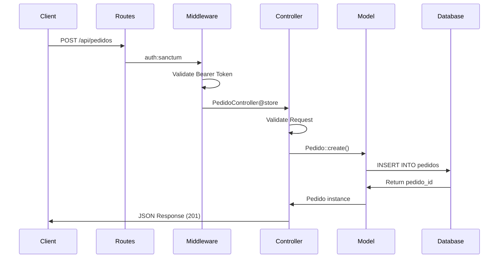

## Introduction

SOLARE is a Laravel 12 RESTful API designed for a luxury furniture e-commerce platform. Built with PHP 8.2, the system follows strict architectural principles with clear separation of concerns, JSON-based communication, and robust authentication.

<Note>
The API is fully decoupled from frontend applications and communicates exclusively via JSON responses.
</Note>

## Technology Stack

<CardGroup cols={2}>
  <Card title="Framework" icon="laravel">
    Laravel 12 with PHP 8.2
  </Card>
  <Card title="Authentication" icon="lock">
    Laravel Passport (OAuth2)
  </Card>
  <Card title="Database" icon="database">
    MySQL with custom Spanish column names
  </Card>
  <Card title="Architecture" icon="diagram-project">
    RESTful API with MVC pattern
  </Card>
</CardGroup>

## Project Structure

The SOLARE API follows Laravel's standard directory structure with customizations for the business domain:

```bash
solare-api/
├── app/
│   ├── Http/
│   │   ├── Controllers/
│   │   │   ├── Auth/
│   │   │   │   └── AuthController.php      # Authentication logic
│   │   │   └── Api/
│   │   │       ├── CategoriaController.php  # Category management
│   │   │       ├── ProductoController.php   # Product catalog
│   │   │       ├── PedidoController.php     # Order processing
│   │   │       ├── InventoryController.php  # Stock management
│   │   │       └── ReporteController.php    # Reports & analytics
│   │   └── Middleware/
│   │       └── CheckRole.php                # RBAC middleware
│   ├── Models/
│   │   ├── User.php                         # User/Employee model
│   │   ├── Rol.php                          # Role model
│   │   ├── Cliente.php                      # Customer profile
│   │   ├── Producto.php                     # Product catalog
│   │   ├── VarianteProducto.php            # Product variants
│   │   ├── Categoria.php                    # Product categories
│   │   ├── Material.php                     # Material types
│   │   ├── Pedido.php                       # Orders
│   │   ├── DetallePedido.php               # Order line items
│   │   └── MovimientoInventario.php        # Inventory movements
│   └── Providers/
│       └── AppServiceProvider.php
├── routes/
│   ├── api.php                              # API routes
│   └── web.php
├── database/
│   ├── migrations/                          # Passport migrations
│   └── seeders/
│       └── UsuariosPruebaSeeder.php        # Test users
└── config/
    ├── auth.php                             # Authentication config
    └── passport.php                         # Passport config
```

## Architectural Layers

### 1. Routing Layer

All API endpoints are defined in `routes/api.php` with grouped middleware protection:

```php routes/api.php
// Public routes
Route::post('/login', [AuthController::class, 'login']);
Route::post('/register', [AuthController::class, 'register']);
Route::get('/productos', [ProductoController::class, 'index']);

// Protected routes (authentication required)
Route::middleware('auth:sanctum')->group(function () {
    Route::post('/logout', [AuthController::class, 'logout']);
    
    // Role-based access control
    Route::middleware('role:Administrador')->group(function () {
        Route::post('/admin/crear-empleado', [AuthController::class, 'storeEmployee']);
    });
    
    Route::middleware('role:Administrador,Gerente,Almacenista')->group(function () {
        Route::put('/inventario/{id}', [InventoryController::class, 'updateStock']);
    });
});
```

<Info>
Note the use of `auth:sanctum` middleware despite Passport being the primary authentication mechanism. The API routes reference Sanctum but the actual authentication is handled by Passport.
</Info>

### 2. Controller Layer

Controllers handle HTTP request/response logic and orchestrate business operations:

**Responsibilities:**
- Request validation
- Business logic coordination
- Response formatting (JSON)
- Transaction management

```php app/Http/Controllers/Api/PedidoController.php
public function store(Request $request)
{
    $request->validate([
        'productos' => 'required|array|min:1',
        'productos.*.variante_id' => 'required|exists:variantes_producto,id',
        'productos.*.cantidad' => 'required|integer|min:1',
    ]);

    try {
        DB::beginTransaction();
        
        $pedido = Pedido::create([...]);
        // Create order details...
        
        DB::commit();
        return response()->json(['status' => 'success', 'pedido_id' => $pedido->id], 201);
    } catch (\Exception $e) {
        DB::rollBack();
        return response()->json(['status' => 'error', 'message' => $e->getMessage()], 500);
    }
}
```

### 3. Model Layer (Eloquent ORM)

Models represent database entities with custom Spanish table and column names:

**Key Features:**
- Custom timestamp column names (`creado_en`, `actualizado_en`)
- Eloquent relationships (One-to-Many, Many-to-One)
- Mass assignment protection with `$fillable`
- Custom table names via `$table` property

```php app/Models/Producto.php
class Producto extends Model
{
    protected $table = 'productos';
    
    protected $fillable = [
        'categoria_id', 'nombre', 'descripcion', 
        'precio_base', 'sku_base', 'activo'
    ];
    
    public function categoria() {
        return $this->belongsTo(Categoria::class, 'categoria_id');
    }
    
    public function variantes() {
        return $this->hasMany(VarianteProducto::class, 'producto_id');
    }
}
```

### 4. Middleware Layer

**CheckRole Middleware** - Custom RBAC implementation:

```php app/Http/Middleware/CheckRole.php
public function handle(Request $request, Closure $next, ...$roles): Response
{
    if (!$request->user() || !$request->user()->rol) {
        return response()->json(['message' => 'Sin permisos de acceso'], 403);
    }
    
    if (!in_array($request->user()->rol->nombre, $roles)) {
        return response()->json([
            'message' => 'Acceso denegado: Tu rol (' . $request->user()->rol->nombre . 
                        ') no tiene permiso para esta acción.'
        ], 403);
    }
    
    return $next($request);
}
```

Registered in `bootstrap/app.php`:

```php bootstrap/app.php
->withMiddleware(function (Middleware $middleware) {
    $middleware->alias([
        'role' => \App\Http\Middleware::class . '\CheckRole',
    ]);
})
```

## Design Patterns

<Tabs>
  <Tab title="Repository Pattern">
    While not explicitly implemented, the API uses Eloquent models as implicit repositories:
    
    - Models encapsulate data access logic
    - Query scopes and relationships abstract complex queries
    - Controllers remain thin by delegating to models
  </Tab>
  
  <Tab title="Service Layer">
    Business logic is handled within controllers with transaction management:
    
    ```php
    DB::transaction(function () use ($request) {
        $user = User::create([...]);
        Cliente::create(['usuario_id' => $user->id, ...]);
        return $user->createToken('SolareToken')->accessToken;
    });
    ```
  </Tab>
  
  <Tab title="Factory Pattern">
    Laravel's built-in factories for testing:
    
    ```php
    UserFactory::new()->create([
        'rol_id' => Rol::where('nombre', 'Cliente')->first()->id
    ]);
    ```
  </Tab>
</Tabs>

## Request/Response Flow



## Database Conventions

<Warning>
The database uses **Spanish column names** which requires custom configuration in models.
</Warning>

### Timestamp Customization

```php
const CREATED_AT = 'creado_en';
const UPDATED_AT = 'actualizado_en';
```

Some models disable `updated_at` entirely:

```php app/Models/MovimientoInventario.php
const CREATED_AT = 'fecha_movimiento';
const UPDATED_AT = null;  // No update tracking
```

## API Response Format

All endpoints return consistent JSON structures:

<Tabs>
  <Tab title="Success Response">
    ```json
    {
      "status": "success",
      "data": {
        "id": 1,
        "nombre": "Sofá Moderno"
      }
    }
    ```
  </Tab>
  
  <Tab title="Error Response">
    ```json
    {
      "status": "error",
      "message": "Producto no encontrado"
    }
    ```
  </Tab>
  
  <Tab title="Validation Error">
    ```json
    {
      "message": "The correo has already been taken.",
      "errors": {
        "correo": [
          "The correo has already been taken."
        ]
      }
    }
    ```
  </Tab>
</Tabs>

## Transaction Management

Critical operations use database transactions to ensure data consistency:

```php app/Http/Controllers/Auth/AuthController.php
return DB::transaction(function () use ($request) {
    // 1. Find Cliente role
    $rolCliente = Rol::where('nombre', 'Cliente')->first();
    
    // 2. Create user
    $user = User::create([...]);
    
    // 3. Create customer profile
    Cliente::create(['usuario_id' => $user->id, ...]);
    
    // 4. Generate Passport token
    $token = $user->createToken('SolareToken')->accessToken;
    
    return response()->json(['access_token' => $token], 201);
});
```

## Error Handling

HTTP status codes follow RESTful conventions:

| Code | Usage |
|------|-------|
| `200` | Successful GET/PUT requests |
| `201` | Resource created (POST) |
| `400` | Bad request / validation error |
| `401` | Unauthenticated (missing/invalid token) |
| `403` | Forbidden (insufficient role permissions) |
| `404` | Resource not found |
| `422` | Unprocessable entity (validation) |
| `500` | Internal server error |

## Performance Considerations

### Eager Loading

Prevent N+1 queries by eager loading relationships:

```php app/Http/Controllers/Api/ProductoController.php
$productos = Producto::with(['categoria', 'variantes.material', 'imagenes'])
    ->where('activo', 1)
    ->get();
```

### Database Triggers

Inventory decrements are handled by **MySQL triggers** rather than application logic:

```php
// When DetallePedido is created, a DB trigger automatically
// decrements VarianteProducto.existencias
DetallePedido::create([
    'pedido_id' => $pedido->id,
    'variante_id' => $item['variante_id'],
    'cantidad' => $item['cantidad']
]);
```

<Info>
This approach ensures atomic stock updates and maintains data integrity even under high concurrency.
</Info>

## Next Steps

<CardGroup cols={2}>
  <Card title="Database Schema" icon="database" href="/architecture/database-schema">
    Explore the complete database structure and relationships
  </Card>
  <Card title="Authentication" icon="shield" href="/architecture/authentication">
    Learn about Passport OAuth2 implementation
  </Card>
  <Card title="Roles & Permissions" icon="users-gear" href="/architecture/roles-permissions">
    Understand the RBAC system and middleware
  </Card>
  <Card title="API Reference" icon="code" href="/api/auth/login">
    Browse all available endpoints
  </Card>
</CardGroup>