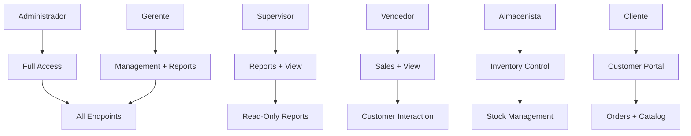

## Overview

SOLARE implements a **Role-Based Access Control (RBAC)** system with 6 distinct roles. The system uses a custom `CheckRole` middleware to enforce permissions at the route level.

<Note>
Unlike traditional permission-based systems, SOLARE uses **role-based routing** where entire route groups are restricted by role names.
</Note>

## Role Hierarchy

The system defines 6 roles stored in the `roles` table:

| ID | Role Name | Description | Access Level |
|----|-----------|-------------|-------------|
| 1 | **Administrador** | Full system control | All endpoints |
| 2 | **Gerente** | Management operations | Reports, inventory view, employee management |
| 3 | **Supervisor** | Oversight functions | Reports, inventory view |
| 4 | **Vendedor** | Sales operations | Inventory view, basic customer management |
| 5 | **Almacenista** | Warehouse management | Inventory read/write, stock adjustments |
| 6 | **Cliente** | Customer access | Orders, profile, public catalog |



## Role Model

```php app/Models/Rol.php
class Rol extends Model
{
    protected $table = 'roles';
    
    protected $fillable = [
        'nombre',
        'descripcion'
    ];
    
    public function usuarios() {
        return $this->hasMany(User::class, 'rol_id');
    }
}
```

**Database Structure:**

```sql
CREATE TABLE roles (
    id INT PRIMARY KEY AUTO_INCREMENT,
    nombre VARCHAR(50) UNIQUE NOT NULL,
    descripcion TEXT,
    created_at TIMESTAMP,
    updated_at TIMESTAMP
);
```

## User-Role Relationship

Each user has exactly one role:

```php app/Models/User.php
class User extends Authenticatable
{
    protected $fillable = [
        'nombre',
        'apellido_paterno',
        'correo',
        'contrasena',
        'rol_id',  // Foreign key to roles table
    ];
    
    public function rol() {
        return $this->belongsTo(Rol::class, 'rol_id');
    }
}
```

**Usage Example:**

```php
$user = User::with('rol')->find(1);
echo $user->rol->nombre;  // "Administrador"
```

## CheckRole Middleware

The core of the RBAC system is the custom middleware:

```php app/Http/Middleware/CheckRole.php
namespace App\Http\Middleware;

use Closure;
use Illuminate\Http\Request;
use Symfony\Component\HttpFoundation\Response;

class CheckRole
{
    /**
     * Handle an incoming request.
     *
     * @param  \Illuminate\Http\Request  $request
     * @param  \Closure  $next
     * @param  string  ...$roles
     * @return \Symfony\Component\HttpFoundation\Response
     */
    public function handle(Request $request, Closure $next, ...$roles): Response
    {
        // Check if user is authenticated and has a role
        if (!$request->user() || !$request->user()->rol) {
             return response()->json(['message' => 'Sin permisos de acceso'], 403);
        }
        
        // Verify if user's role is in the allowed roles list
        if (!in_array($request->user()->rol->nombre, $roles)) {
            return response()->json([
                'message' => 'Acceso denegado: Tu rol (' . $request->user()->rol->nombre . 
                            ') no tiene permiso para esta acción.'
            ], 403);
        }
        
        return $next($request);
    }
}
```

### Middleware Registration

The middleware is aliased in `bootstrap/app.php`:

```php bootstrap/app.php
return Application::configure(basePath: dirname(__DIR__))
    ->withMiddleware(function (Middleware $middleware) {
        $middleware->alias([
            'role' => \App\Http\Middleware::class . '\CheckRole',
        ]);
    })
    ->create();
```

<Info>
The middleware accepts **variadic parameters**, allowing multiple roles per route group.
</Info>

## Route Protection Patterns

### Single Role

Restrict routes to a single role:

```php routes/api.php
Route::middleware(['auth:sanctum', 'role:Administrador'])->group(function () {
    Route::get('/admin/dashboard', function () {
        return response()->json(['message' => 'Bienvenido, Administrador']);
    });
    Route::post('/admin/crear-empleado', [AuthController::class, 'storeEmployee']);
    Route::get('/admin/roles', [AuthController::class, 'getRoles']);
});
```

### Multiple Roles

Allow multiple roles to access the same routes:

```php routes/api.php
// Inventory viewing (all internal staff)
Route::middleware('role:Administrador,Gerente,Supervisor,Vendedor,Almacenista')->group(function () {
    Route::get('/inventario', [InventoryController::class, 'index']);
});

// Inventory modification (warehouse + management)
Route::middleware('role:Administrador,Gerente,Almacenista')->group(function () {
    Route::put('/inventario/{id}', [InventoryController::class, 'updateStock']);
});

// Reports (management only)
Route::middleware('role:Administrador,Gerente,Supervisor')->group(function () {
    Route::get('/reportes/ventas', [ReporteController::class, 'ventasResumen']);
    Route::get('/reportes/ventas/pdf', [ReporteController::class, 'exportPdf']);
});
```

### Nested Protection

Combine authentication and role middleware:

```php routes/api.php
Route::middleware('auth:sanctum')->group(function () {
    // All authenticated users
    Route::get('/profile', [AuthController::class, 'profile']);
    Route::post('/logout', [AuthController::class, 'logout']);
    
    // Admin-only routes
    Route::middleware('role:Administrador')->group(function () {
        Route::post('/admin/crear-empleado', [AuthController::class, 'storeEmployee']);
    });
});
```

## Permission Matrix

<Tabs>
  <Tab title="Administrador">
    **Full System Access**
    
    | Feature | Permissions |
    |---------|-------------|
    | User Management | ✅ Create employees, view all users |
    | Inventory | ✅ View, create, update, delete |
    | Orders | ✅ View all orders, modify status |
    | Reports | ✅ All reports, export PDF |
    | Categories/Products | ✅ Full CRUD |
    | Roles | ✅ View, assign |
    
    **Protected Routes:**
    ```php
    POST   /admin/crear-empleado
    GET    /admin/roles
    GET    /admin/dashboard
    PUT    /inventario/{id}
    GET    /reportes/ventas
    GET    /reportes/ventas/pdf
    ```
  </Tab>
  
  <Tab title="Gerente">
    **Management Operations**
    
    | Feature | Permissions |
    |---------|-------------|
    | User Management | ❌ Cannot create users |
    | Inventory | ✅ View, update stock |
    | Orders | ✅ View all orders |
    | Reports | ✅ All reports, export PDF |
    | Categories/Products | ✅ View, may modify |
    
    **Protected Routes:**
    ```php
    GET    /inventario
    PUT    /inventario/{id}
    GET    /reportes/ventas
    GET    /reportes/ventas/pdf
    ```
  </Tab>
  
  <Tab title="Supervisor">
    **Oversight & Reporting**
    
    | Feature | Permissions |
    |---------|-------------|
    | User Management | ❌ No access |
    | Inventory | ✅ View only |
    | Orders | ✅ View only |
    | Reports | ✅ View and export |
    | Categories/Products | ✅ View only |
    
    **Protected Routes:**
    ```php
    GET    /inventario
    GET    /reportes/ventas
    GET    /reportes/ventas/pdf
    ```
  </Tab>
  
  <Tab title="Vendedor">
    **Sales Operations**
    
    | Feature | Permissions |
    |---------|-------------|
    | User Management | ❌ No access |
    | Inventory | ✅ View stock levels |
    | Orders | ✅ View, create (limited) |
    | Reports | ❌ No access |
    | Categories/Products | ✅ View catalog |
    
    **Protected Routes:**
    ```php
    GET    /inventario
    ```
  </Tab>
  
  <Tab title="Almacenista">
    **Warehouse Management**
    
    | Feature | Permissions |
    |---------|-------------|
    | User Management | ❌ No access |
    | Inventory | ✅ Full control (view, update) |
    | Orders | ✅ View for fulfillment |
    | Reports | ❌ No access |
    | Categories/Products | ✅ View only |
    
    **Protected Routes:**
    ```php
    GET    /inventario
    PUT    /inventario/{id}
    ```
    
    **Inventory Controller Example:**
    ```php app/Http/Controllers/Api/InventoryController.php
    public function updateStock(Request $request, $id)
    {
        // Only Administrador, Gerente, Almacenista can access
        $variante = VarianteProducto::findOrFail($id);
        
        // Record who made the change
        MovimientoInventario::create([
            'variante_id' => $variante->id,
            'tipo' => $request->tipo,
            'cantidad' => $request->cantidad,
            'usuario_id' => $request->user()->id,  // Audit trail
            'motivo' => $request->motivo
        ]);
    }
    ```
  </Tab>
  
  <Tab title="Cliente">
    **Customer Portal**
    
    | Feature | Permissions |
    |---------|-------------|
    | User Management | ❌ Self-registration only |
    | Inventory | ✅ View public catalog |
    | Orders | ✅ Create, view own orders |
    | Reports | ❌ No access |
    | Categories/Products | ✅ View public catalog |
    
    **Public Routes (no auth):**
    ```php
    GET    /categorias
    GET    /productos
    GET    /productos/{id}
    POST   /register
    POST   /login
    ```
    
    **Protected Routes:**
    ```php
    GET    /pedidos          // Own orders only
    POST   /pedidos          // Create new order
    GET    /profile
    POST   /logout
    ```
    
    **Order Scope Example:**
    ```php app/Http/Controllers/Api/PedidoController.php
    public function index(Request $request)
    {
        // Clientes only see their own orders
        $cliente = Cliente::where('usuario_id', $request->user()->id)->first();
        
        $pedidos = Pedido::where('cliente_id', $cliente->id)->get();
        return response()->json(['data' => $pedidos]);
    }
    ```
  </Tab>
</Tabs>

## Complete Route Structure

```php routes/api.php
use App\Http\Controllers\Auth\AuthController;
use App\Http\Controllers\Api\{CategoriaController, ProductoController, PedidoController, InventoryController, ReporteController};

// ========== PUBLIC ROUTES ==========
Route::post('/login', [AuthController::class, 'login']);
Route::post('/register', [AuthController::class, 'register']);  // Cliente role only

// Public catalog
Route::get('/categorias', [CategoriaController::class, 'index']);
Route::get('/productos', [ProductoController::class, 'index']);
Route::get('/productos/{id}', [ProductoController::class, 'show']);

// ========== PROTECTED ROUTES ==========
Route::middleware('auth:sanctum')->group(function () {
    // All authenticated users
    Route::post('/logout', [AuthController::class, 'logout']);
    Route::get('/profile', [AuthController::class, 'profile']);
    
    // Customer orders
    Route::get('/pedidos', [PedidoController::class, 'index']);
    Route::post('/pedidos', [PedidoController::class, 'store']);
    
    // ========== ROLE-BASED ROUTES ==========
    
    // Admin only
    Route::middleware('role:Administrador')->group(function () {
        Route::get('/admin/dashboard', fn() => response()->json(['message' => 'Admin Panel']));
        Route::get('/admin/roles', [AuthController::class, 'getRoles']);
        Route::post('/admin/crear-empleado', [AuthController::class, 'storeEmployee']);
    });
    
    // All internal staff (inventory view)
    Route::middleware('role:Administrador,Gerente,Supervisor,Vendedor,Almacenista')->group(function () {
        Route::get('/inventario', [InventoryController::class, 'index']);
    });
    
    // Warehouse + Management (inventory write)
    Route::middleware('role:Administrador,Gerente,Almacenista')->group(function () {
        Route::put('/inventario/{id}', [InventoryController::class, 'updateStock']);
    });
    
    // Management + Oversight (reports)
    Route::middleware('role:Administrador,Gerente,Supervisor')->group(function () {
        Route::get('/reportes/ventas', [ReporteController::class, 'ventasResumen']);
        Route::get('/reportes/ventas/pdf', [ReporteController::class, 'exportPdf']);
    });
});
```

## Role Assignment

### During Registration (Cliente)

Customers are automatically assigned the `Cliente` role:

```php app/Http/Controllers/Auth/AuthController.php
public function register(Request $request)
{
    $rolCliente = Rol::where('nombre', 'Cliente')->first();
    
    $user = User::create([
        'nombre' => $request->nombre,
        'correo' => $request->correo,
        'contrasena' => Hash::make($request->contrasena),
        'rol_id' => $rolCliente->id ?? 3,  // Default to ID 3
    ]);
}
```

### Employee Creation (Admin)

Administrators assign roles when creating staff accounts:

```php app/Http/Controllers/Auth/AuthController.php
public function storeEmployee(Request $request)
{
    $request->validate([
        'rol_id' => 'required|exists:roles,id',
        // ... other fields
    ]);
    
    // Prevent creating Cliente via this route
    $rolCliente = Rol::where('nombre', 'Cliente')->first();
    if ($request->rol_id == $rolCliente->id) {
        return response()->json([
            'message' => 'Para crear clientes use la ruta de registro pública'
        ], 400);
    }
    
    $user = User::create([
        'rol_id' => $request->rol_id,
        // ... other fields
    ]);
}
```

**Get Available Roles:**

```php
Route::get('/admin/roles', [AuthController::class, 'getRoles']);

public function getRoles()
{
    return response()->json(Rol::all());
}
```

## Access Denied Responses

### 403 - Role Not Authorized

```json
{
  "message": "Acceso denegado: Tu rol (Vendedor) no tiene permiso para esta acción."
}
```

**Triggered when:**
- User is authenticated
- User has a valid role
- Role is not in the allowed list for the route

### 403 - No Role Assigned

```json
{
  "message": "Sin permisos de acceso"
}
```

**Triggered when:**
- User is authenticated
- User has no role assigned (`rol_id` is null)
- User's role relationship is broken

## Audit Trail

Role-based actions are tracked via the `usuario_id` field:

```php app/Models/MovimientoInventario.php
protected $fillable = [
    'variante_id',
    'tipo',
    'cantidad',
    'usuario_id',  // Tracks who made the change
    'motivo'
];

public function usuario() {
    return $this->belongsTo(User::class, 'usuario_id');
}
```

**Query Audit Trail:**

```php
$movimientos = MovimientoInventario::with('usuario.rol')
    ->whereHas('usuario.rol', function($query) {
        $query->where('nombre', 'Almacenista');
    })
    ->get();

foreach ($movimientos as $mov) {
    echo "{$mov->usuario->nombre} ({$mov->usuario->rol->nombre}) "
       . "modified inventory at {$mov->fecha_movimiento}";
}
```

## Testing Role Protection

### Postman Example

1. **Login as Admin:**
   ```json
   POST /api/login
   {
     "correo": "admin@solare.com",
     "contrasena": "password123"
   }
   ```
   
2. **Save Token:**
   ```
   Authorization: Bearer <admin_token>
   ```
   
3. **Access Admin Route (Success):**
   ```
   GET /api/admin/roles
   Headers: Authorization: Bearer <admin_token>
   
   Response: 200 OK
   [
     {"id": 1, "nombre": "Administrador"},
     {"id": 2, "nombre": "Gerente"},
     ...
   ]
   ```
   
4. **Login as Cliente:**
   ```json
   POST /api/login
   {
     "correo": "cliente@solare.com",
     "contrasena": "password123"
   }
   ```
   
5. **Access Admin Route (Denied):**
   ```
   GET /api/admin/roles
   Headers: Authorization: Bearer <cliente_token>
   
   Response: 403 Forbidden
   {
     "message": "Acceso denegado: Tu rol (Cliente) no tiene permiso para esta acción."
   }
   ```

## Best Practices

<AccordionGroup>
  <Accordion title="Always Load Roles Eagerly">
    Prevent N+1 queries by eager loading the role relationship:
    
    ```php
    // Bad
    $users = User::all();
    foreach ($users as $user) {
        echo $user->rol->nombre;  // N+1 query
    }
    
    // Good
    $users = User::with('rol')->get();
    foreach ($users as $user) {
        echo $user->rol->nombre;  // Single query
    }
    ```
  </Accordion>
  
  <Accordion title="Use Role Names, Not IDs">
    The middleware compares role **names** (strings), not IDs:
    
    ```php
    // Correct
    Route::middleware('role:Administrador,Gerente')->group(...);
    
    // Incorrect (will not work)
    Route::middleware('role:1,2')->group(...);
    ```
  </Accordion>
  
  <Accordion title="Validate Role Existence">
    When assigning roles, always validate against existing roles:
    
    ```php
    $request->validate([
        'rol_id' => 'required|exists:roles,id'
    ]);
    ```
  </Accordion>
  
  <Accordion title="Separate Customer and Employee Creation">
    Use different endpoints to prevent privilege escalation:
    
    - `/register` → Always creates `Cliente`
    - `/admin/crear-empleado` → Creates any role except `Cliente` (Admin only)
  </Accordion>
</AccordionGroup>

## Next Steps

<CardGroup cols={2}>
  <Card title="Authentication" icon="shield" href="/architecture/authentication">
    Understand how users obtain tokens
  </Card>
  <Card title="API Reference" icon="code" href="/api/auth/login">
    Explore protected endpoints by role
  </Card>
  <Card title="Database Schema" icon="database" href="/architecture/database-schema">
    See how roles relate to users
  </Card>
</CardGroup>